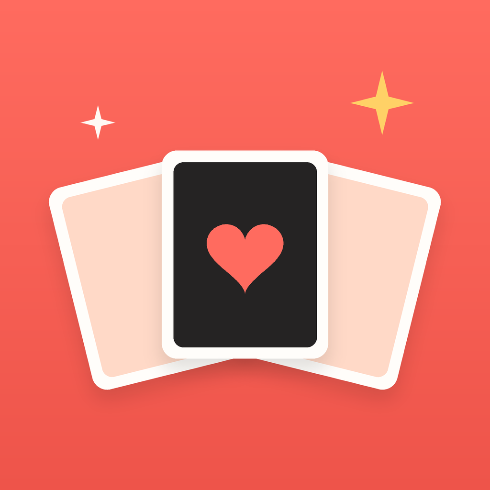
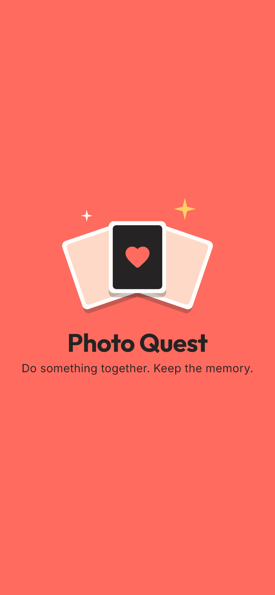
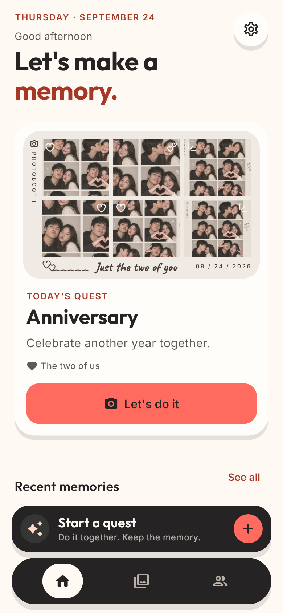
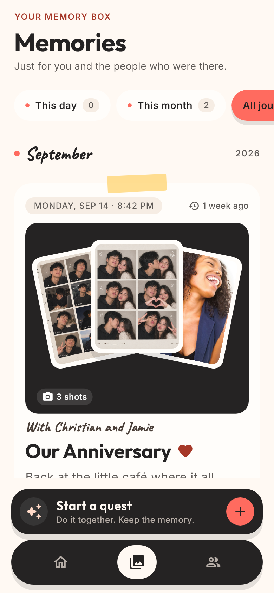
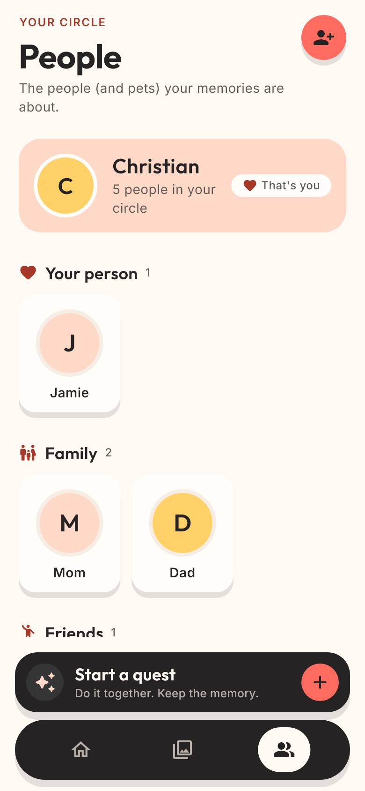

<p align="center">
  
</p>

<h1 align="center">Photo Quest</h1>

<p align="center">
  <strong>Do something together. Take the picture. Keep the memory.</strong>
</p>

<p align="center">
  
  
  
  
</p>

Photo Quest turns everyday moments into shared adventures. Pick a quest,
invite your partner, family or friends, then do it together in real life. A
playful photobooth guides every shot, and each quest becomes a memory you can
relive year after year.

It's private by design: no feed, no likes, no followers. V1 is
**local-first**, so there's no account and everything stays on the device.

<p align="center">
  
  
  
  
</p>

## Features

- **Quests:** guided real-life activities for couples, families, friends,
  pets or just you, with a new "Today's Quest" every day.
- **Photobooth:** countdown, pose ideas, and Photo, GIF, Boomerang and 360°
  modes, with film-style looks.
- **Memories:** a private journal of fanned prints, filtered by *This day*,
  *This month* or *All journey*. Tap any photo to view it full screen.
- **Keepsakes:** printed strips, grids and polaroids you can decorate, save
  and share.
- **People:** your circle, grouped as your person, family, friends and pets.
- **Do it again:** repeat a quest each year and watch the memories grow.

## Tech stack

| Concern            | Package                                       | Version     |
| ------------------ | --------------------------------------------- | ----------- |
| Framework          | Flutter / Dart                                | 3.47 / 3.13 |
| Camera             | `camera`                                      | ^0.11.0     |
| Local database     | `drift`, `drift_flutter` (SQLite)             | ^2.20 / ^0.3 |
| State & DI         | `flutter_riverpod`, `riverpod_annotation`     | ^3.0 / ^4.0 |
| Navigation         | `go_router`                                   | ^14.6       |
| Image processing   | `image`                                       | ^4.3        |
| Video playback     | `video_player`                                | ^2.11       |
| Files & sharing    | `path_provider`, `share_plus`, `gal`          | ^2.1 / ^10.1 / ^2.3 |
| Utilities          | `uuid`, `intl`, `path`                        | ^4.5 / ^0.19 / ^1.9 |
| Code generation    | `build_runner`, `drift_dev`, `riverpod_generator` | dev only |
| Linting            | `flutter_lints`                               | ^6.0        |

Fonts are bundled (SIL OFL): **Outfit** for headings, **Inter** for body
text and **Caveat** for handwritten touches.

## Getting started

```bash
flutter pub get
dart run build_runner build --delete-conflicting-outputs
flutter run
```

Run `build_runner` again after changing a Drift table, a DAO or a
`@riverpod` provider. Generated `*.g.dart` files are committed.

Before every commit, all three must pass:

```bash
dart format lib test
flutter analyze
flutter test
```

## Architecture

Layered, one-way: **Presentation → Domain → Data.** Photos are files;
memories are data (SQLite holds only metadata).

```text
lib/
├── config/        # design tokens (AppColors, AppTypography, …) and routing
└── core/
    ├── domain/        # entities: Quest, Person, Memory, Photo, …
    ├── data/          # Drift database, repositories, services
    └── presentation/  # screen → view_model → template, atomic widgets
```

Each screen is split into a thin **Screen** (wiring and navigation), a
Riverpod **View model** (state and logic) and a **Template** (pure page
design with a widget preview). The full product and engineering spec is in
[CLAUDE.md](CLAUDE.md).

## Versioning

The app follows [Semantic Versioning](https://semver.org). The version lives
in `pubspec.yaml` as `MAJOR.MINOR.PATCH+BUILD`:

```yaml
version: 1.0.0+1   # 1.0.0 is the version users see, +1 is the build number
```

- Bump **PATCH** for fixes, **MINOR** for new features, **MAJOR** for
  breaking changes such as a data migration that can't be undone.
- Increase the **build number** on every store upload. Android uses it as
  `versionCode` and iOS as `CFBundleVersion`.
- Record each release in [CHANGELOG.md](CHANGELOG.md).

## App icon and launch screen

The master icon is [`assets/icon/app_icon.png`](assets/icon/app_icon.png)
(1024 × 1024): three fanned photobooth prints on warm coral. Every Android
and iOS icon size, the Android adaptive icon and both launch screens are
made from it and committed under `android/` and `ios/`. Replace them all
together if the icon changes.

## Credits

Example quest photos are from [Unsplash](https://unsplash.com), listed in
[`assets/images/quests/CREDITS.md`](assets/images/quests/CREDITS.md).
