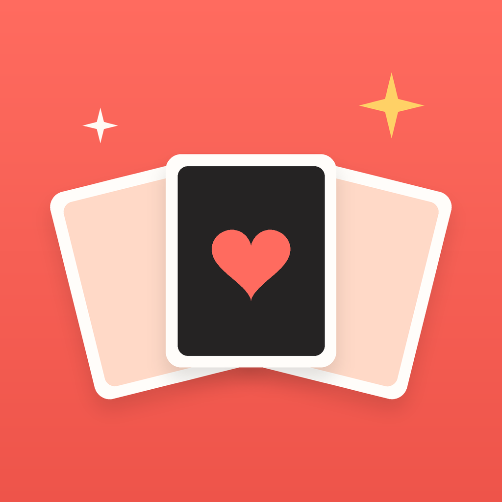
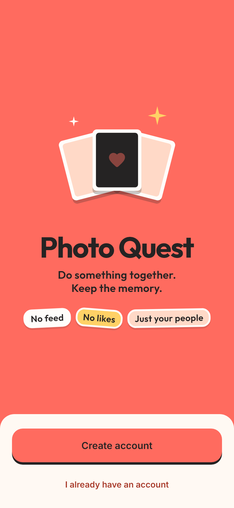
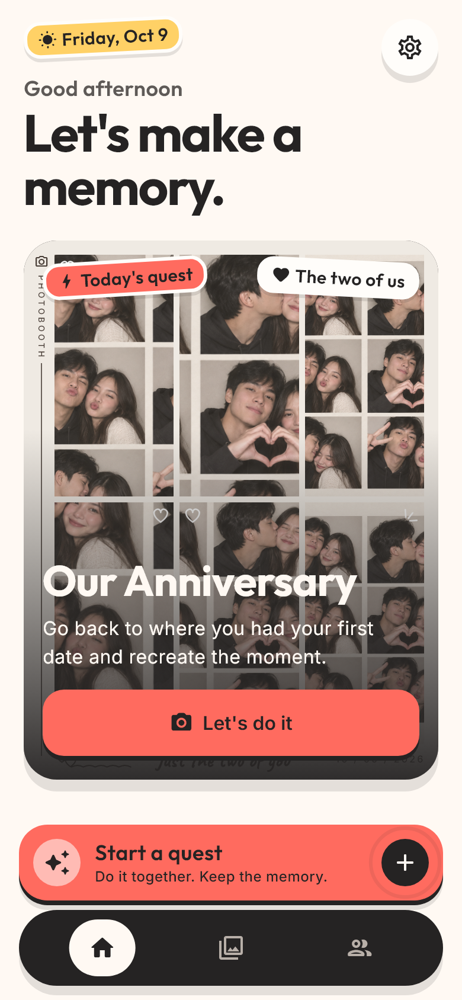
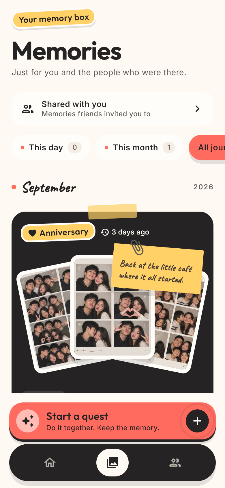
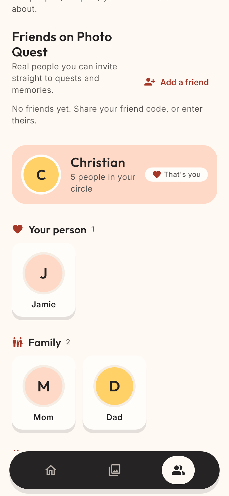

<p align="center">
  
</p>

<h1 align="center">Photo Quest</h1>

<p align="center">
  <strong>Do something together. Take the picture. Keep the memory.</strong>
</p>

<p align="center">
  <a href="https://github.com/Christian0162/photoquest/actions/workflows/ci.yml"></a>
  
  
  
  
</p>

Photo Quest turns everyday moments into shared adventures. Pick a quest,
invite your partner, family or friends, then do it together in real life. A
playful photobooth guides every shot, and each quest becomes a memory you can
relive year after year.

It's private by design: no feed, no likes, no followers. V1 is
**local-first**, so there's no account and everything stays on the device.

<p align="center">
  
  
  
  
</p>

## Features

- **Quests:** guided real-life activities for couples, families, friends,
  pets or just you, with a new "Today's Quest" every day.
- **Photobooth:** countdown, pose ideas, and Photo, GIF, Boomerang and 360°
  modes, with film-style looks.
- **Memories:** a private journal of fanned prints, filtered by *This day*,
  *This month* or *All journey*. Tap any photo to view it full screen.
- **Keepsakes:** printed strips, grids and polaroids you can decorate, save
  and share.
- **People:** your circle, grouped as your person, family, friends and pets.
- **Do it again:** repeat a quest each year and watch the memories grow.

## Tech stack

| Concern            | Package                                       | Version     |
| ------------------ | --------------------------------------------- | ----------- |
| Framework          | Flutter / Dart                                | 3.47 / 3.13 |
| Camera             | `camera`                                      | ^0.11.0     |
| Local database     | `drift`, `drift_flutter` (SQLite)             | ^2.20 / ^0.3 |
| State & DI         | `flutter_riverpod`, `riverpod_annotation`     | ^3.0 / ^4.0 |
| Navigation         | `go_router`                                   | ^14.6       |
| Image processing   | `image`                                       | ^4.3        |
| Video playback     | `video_player`                                | ^2.11       |
| Files & sharing    | `path_provider`, `share_plus`, `gal`          | ^2.1 / ^10.1 / ^2.3 |
| Utilities          | `uuid`, `intl`, `path`                        | ^4.5 / ^0.19 / ^1.9 |
| Code generation    | `build_runner`, `drift_dev`, `riverpod_generator` | dev only |
| Linting            | `flutter_lints`                               | ^6.0        |

Fonts are bundled (SIL OFL): **Outfit** for headings, **Inter** for body
text and **Caveat** for handwritten touches.

## Getting started

```bash
flutter pub get
dart run build_runner build --delete-conflicting-outputs
flutter run
```

Run `build_runner` again after changing a Drift table, a DAO or a
`@riverpod` provider. Generated `*.g.dart` files are committed.

Before every commit, all three must pass:

```bash
dart format lib test
flutter analyze
flutter test
```

[CI](.github/workflows/ci.yml) runs the same checks on every push and pull
request. It also makes sure the generated code is up to date and builds an
Android APK, which you can download from the run's artifacts. Dependabot
opens weekly PRs for package updates.

## Architecture

Layered, one-way: **Presentation → Domain → Data.** Photos are files;
memories are data (SQLite holds only metadata).

```text
lib/
├── main.dart              # bootstraps app.dart only
├── app.dart               # root MaterialApp.router
├── config/
│   ├── constant/          # AppColors, AppTypography, AppSpacing, AppConstants, AppTheme
│   └── routes/            # app_router.dart, app_shell.dart — all navigation lives here
└── core/
    ├── domain/                # one folder per domain area
    │   ├── quests/entities/
    │   ├── memories/entities/
    │   └── people/entities/
    ├── data/
    │   ├── database/          # app_database.dart, tables/, daos/, seed/
    │   ├── services/          # camera/, storage/, image/, sharing/, gallery/
    │   └── repositories/      # flat: one repository (+ provider) per aggregate
    └── presentation/
        ├── screen/            # one subfolder per domain area (home, quests, camera, memories, people, settings)
        ├── view_model/        # mirrors screen/, one ViewModel per screen
        ├── types/             # UI-only state/type helpers, mirrors screen/
        └── widget/            # shared, atomic-design tiers
            ├── atoms/         # PrimaryButton, PersonAvatar, …
            ├── molecules/     # AppCard, EmptyState, …
            ├── organisms/     # AppScaffold, QuestCard, MemoryCard, …
            └── templates/     # one *_template.dart per screen + *_template_preview.dart
```

Each screen is split into three files that live in matching subfolders,
and each one has exactly one job:

- **Screen** (`screen/<area>/`) — **logic lives here.** A
  `ConsumerWidget` that watches ViewModels, wires callbacks, navigation,
  dialogs, sheets and snackbars. No layout.
- **View model** (`view_model/<area>/`) — state, validation, derived
  data and actions (Riverpod `Notifier`/`AsyncNotifier`).
- **Template** (`widget/template/`) — **no logic, ever.** The full page
  layout as plain data + callbacks in; it never touches `ref`, the
  router, or a repository/service. If it needs to know something, it's
  passed in as a parameter, not looked up.

Only create a domain-area subfolder, or a new atomic-tier entry, when a
screen or component actually exists for it — don't scaffold empty
folders ahead of need. See [CLAUDE.md §22–23](CLAUDE.md) for the full
rationale.

### Naming conventions

| What          | Convention             | Example                          |
| ------------- | ----------------------- | --------------------------------- |
| Files         | `snake_case.dart`        | `memory_detail_view_model.dart`  |
| Classes       | `PascalCase`             | `MemoryDetailViewModel`          |
| Variables     | `camelCase`              | `selectedParticipants`           |
| Screens (logic)   | `<name>_screen.dart` | `memory_detail_screen.dart`      |
| View models   | `<name>_view_model.dart` | `memory_detail_view_model.dart`  |
| Templates (no logic) | `<name>_template.dart` | `memory_detail_template.dart` |
| Template previews | `<name>_template_preview.dart` | `memory_detail_template_preview.dart` |
| Atoms         | `md_<name>.dart` in `widget/atoms/` | `md_primary_button.dart` → `MdPrimaryButton` |
| Molecules     | `md_<name>.dart` in `widget/molecules/` | `md_app_card.dart` → `MdAppCard` |
| Organisms     | `md_<name>.dart` in `widget/organisms/` | `md_app_scaffold.dart` → `MdAppScaffold` |
| Repositories  | `<aggregate>_repository.dart` | `quest_repository.dart`    |
| Drift tables  | `<name>_table.dart`      | `quest_shots_table.dart`         |
| DAOs          | `<name>_dao.dart`        | `quests_dao.dart`                |

Atoms, molecules and organisms all carry an `md_` file prefix (classes:
`Md` + `PascalCase`, e.g. `MdPrimaryButton`) regardless of tier — the
tier is expressed only by which folder the file lives in, not by a
different prefix per tier. A screen, its ViewModel and its template
always share the same base name
(`memory_detail_*`) across their three folders, so they're easy to find
side by side. Avoid vague names like `helper.dart`, `manager.dart` or
`utils2.dart` — prefer specific ones (`photo_storage_service.dart`, not
`storage_helper.dart`). The full product and engineering spec is in
[CLAUDE.md](CLAUDE.md).

## Versioning

The app follows [Semantic Versioning](https://semver.org). The version lives
in `pubspec.yaml` as `MAJOR.MINOR.PATCH+BUILD`:

```yaml
version: 1.0.0+1   # 1.0.0 is the version users see, +1 is the build number
```

- Bump **PATCH** for fixes, **MINOR** for new features, **MAJOR** for
  breaking changes such as a data migration that can't be undone.
- Increase the **build number** on every store upload. Android uses it as
  `versionCode` and iOS as `CFBundleVersion`.
- Record each release in [CHANGELOG.md](CHANGELOG.md).

## App icon and launch screen

The master icon is [`assets/icon/app_icon.png`](assets/icon/app_icon.png)
(1024 × 1024): three fanned photobooth prints on warm coral. Every Android
and iOS icon size, the Android adaptive icon and both launch screens are
made from it and committed under `android/` and `ios/`. Replace them all
together if the icon changes.

## Credits

Example quest photos are from [Unsplash](https://unsplash.com), listed in
[`assets/images/quests/CREDITS.md`](assets/images/quests/CREDITS.md).
